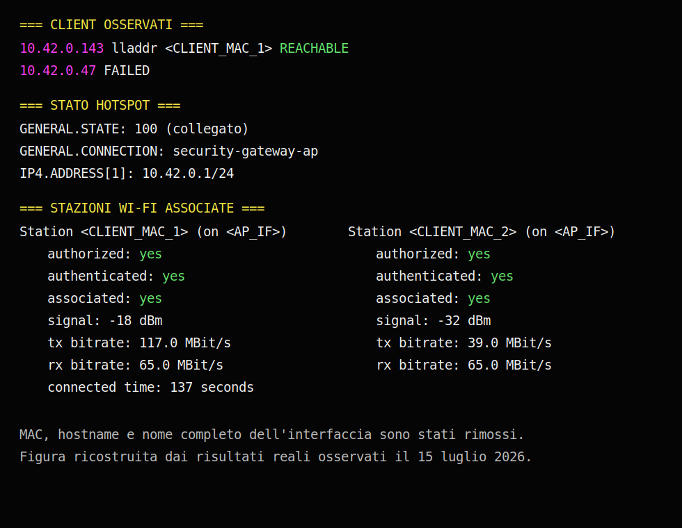

# Fase 3 — Hotspot Wi-Fi con Realtek USB

## Stato

```text
COMPLETATA E VERIFICATA
```

Verifica eseguita il 15 luglio 2026 su Ubuntu 26.04 LTS con kernel `7.0.0-27-generic`.

## Obiettivo

Creare un hotspot di laboratorio stabile sulla scheda Realtek USB senza interrompere la connessione Internet della MediaTek.

## Prerequisiti

- fase 1 completata;
- fase 2 completata;
- `AP_IF` e `UPLINK_IF` verificati;
- supporto `AP` dichiarato dalla radio Realtek;
- console locale disponibile;
- password di laboratorio non pubblicata nel repository.

## Valori usati

```text
UPLINK_IF=wlp13s0
AP_IF=wlx<REDACTED>
HOTSPOT_PROFILE=security-gateway-ap
LAB_SSID=SecurityGatewayLab
WIFI_BAND=2.4GHz
WIFI_CHANNEL=6
GATEWAY_IP=10.42.0.1/24
IPV4_METHOD=shared
IPV6_MODE=disabled
AUTOCONNECT=no
```

Il nome completo dell'interfaccia Realtek, gli indirizzi MAC e il segreto WPA rimangono esclusivamente nei dati locali.

## Approccio usato

La prima configurazione usa NetworkManager, perché consente di creare rapidamente un profilo hotspot e verificare radio, DHCP, associazione dei client, condivisione IPv4 e rollback. Nelle fasi successive DHCP, routing, NAT e firewall verranno osservati e documentati più nel dettaglio.

## Attività completate

- [x] salvare in un file locale lo stato completo dei profili NetworkManager;
- [x] creare un profilo hotspot con nome riconoscibile;
- [x] impostare SSID e sicurezza WPA-PSK;
- [x] scegliere banda 2,4 GHz e canale 6;
- [x] attivare il profilo sulla sola Realtek;
- [x] verificare che la MediaTek resti collegata;
- [x] collegare dispositivi autorizzati;
- [x] verificare associazione e indirizzo assegnato;
- [x] fermare e riattivare l'hotspot;
- [x] verificare esplicitamente la raggiungibilità del gateway dal client;
- [x] verificare il rollback eliminando e ricreando il profilo;
- [] verificare il comportamento dopo riavvio: rinviato alla fase 11, perché `connection.autoconnect` è intenzionalmente impostato su `no`.

Il test dopo riavvio non è un requisito di completamento della fase 3: verrà eseguito insieme ai test di persistenza e hardening.

## Dominio regolamentare osservato

È stato richiesto temporaneamente il dominio italiano:

```bash
sudo iw reg set IT
```

Il valore effettivamente mostrato dal kernel dopo il comando è stato:

```text
country 98: DFS-ETSI
```

Il driver o il firmware non ha quindi mostrato letteralmente `IT`, ma ha applicato un dominio ETSI che consente il canale 6 a 2,4 GHz con potenza indicata di 20 dBm. Il comportamento è stato annotato senza tentare forzature aggiuntive.

## Backup locale di NetworkManager

Prima del rollback è stato salvato fuori dal repository un report completo dei profili NetworkManager in una directory privata dell'utente:

```text
~/.local/state/linux-security-lab/networkmanager-profiles-<TIMESTAMP>.txt
```

Sono stati applicati permessi restrittivi:

```text
directory: 700
file:      600
```

Il controllo del report ha mostrato i segreti come:

```text
802-11-wireless-security.psk: <hidden>
```

Il file locale non viene pubblicato perché contiene dettagli identificativi della macchina e delle reti configurate.

## Comandi di creazione realmente eseguiti

I comandi seguenti sono riportati con il nome dell'interfaccia anonimizzato.

```bash
sudo nmcli connection add \
    type wifi \
    ifname <AP_IF> \
    con-name security-gateway-ap \
    ssid SecurityGatewayLab

sudo nmcli connection modify security-gateway-ap \
    connection.autoconnect no \
    802-11-wireless.mode ap \
    802-11-wireless.band bg \
    802-11-wireless.channel 6 \
    802-11-wireless-security.key-mgmt wpa-psk \
    ipv4.method shared \
    ipv4.addresses 10.42.0.1/24 \
    ipv4.never-default yes \
    ipv6.method disabled

sudo nmcli --ask connection up security-gateway-ap ifname <AP_IF>
```

La password è stata inserita interattivamente e non è riportata nella documentazione pubblica.

## Verifiche eseguite

```bash
nmcli device status
nmcli connection show --active
iw dev <AP_IF> info
ip -4 address show dev <AP_IF>
ip -4 route get 1.1.1.1
ip neigh show dev <AP_IF>
sudo iw dev <AP_IF> station dump
```

## Risultati radio e indirizzamento

La Realtek è passata correttamente dalla modalità `managed` alla modalità `AP`:

```text
ssid SecurityGatewayLab
type AP
channel 6 (2437 MHz), width: 20 MHz
txpower 20.00 dBm
```

Il gateway è stato assegnato correttamente all'interfaccia hotspot:

```text
10.42.0.1/24
```

La route predefinita dell'host è rimasta sull'uplink MediaTek:

```text
1.1.1.1 via 192.168.10.1 dev wlp13s0 src 192.168.10.x
```

Durante il test sono risultate due stazioni Wi-Fi associate. Per entrambe `iw` ha mostrato:

```text
authorized: yes
authenticated: yes
associated: yes
```

Un client è comparso nella tabella dei vicini IPv4 come `REACHABLE` con indirizzo `10.42.0.143`. Una seconda voce IPv4 risultava temporaneamente `FAILED`, mentre `iw station dump` mostrava comunque una seconda stazione associata a livello Wi-Fi.

## Verifica esplicita client → gateway

Sul gateway è stato avviato temporaneamente il server HTTP incluso nella libreria standard di Python:

```bash
python3 -m http.server 8000 \
    --bind 10.42.0.1 \
    --directory /tmp/hotspot-gateway-test
```

Dal client collegato all'hotspot è stata aperta la pagina `http://10.42.0.1:8000`. Il gateway ha registrato:

```text
10.42.0.143 - - "GET / HTTP/1.1" 200 -
```

Il codice HTTP `200` dimostra che il client ha raggiunto un servizio esposto sul gateway Ubuntu attraverso la Realtek. Le richieste a `/favicon.ico` hanno restituito `404` perché non era stato creato alcun file favicon; questo non indica un errore del collegamento.

## Rollback verificato

Il profilo è stato prima disattivato:

```bash
sudo nmcli connection down security-gateway-ap
```

Dopo la disattivazione sono stati verificati:

```text
Realtek: disconnessa
profilo: ancora registrato
route Internet: ancora tramite wlp13s0
```

Il profilo è stato quindi eliminato:

```bash
sudo nmcli connection delete security-gateway-ap
```

Dopo l'eliminazione sono stati verificati:

```text
profilo security-gateway-ap: assente
Realtek: disconnessa
indirizzo 10.42.0.1/24: rimosso
MediaTek: collegata
route Internet: ancora tramite wlp13s0
```

Infine il profilo è stato ricreato con gli stessi parametri, la password è stata inserita nuovamente tramite `nmcli --ask` e l'attivazione è riuscita.

La configurazione ricostruita ha mostrato:

```text
connection.autoconnect: no
802-11-wireless.mode: ap
802-11-wireless.band: bg
802-11-wireless.channel: 6
802-11-wireless-security.key-mgmt: wpa-psk
ipv4.method: shared
ipv4.addresses: 10.42.0.1/24
ipv4.never-default: yes
ipv6.method: disabled
```

La radio è tornata in modalità `AP`, l'indirizzo `10.42.0.1/24` è stato ripristinato e la route Internet dell'host è rimasta sulla MediaTek.

## Prova grafica anonimizzata



La figura è stata ricostruita dallo screenshot reale eliminando:

- indirizzi MAC dei client;
- nome completo dell'interfaccia `wlx...`;
- hostname e percorso del terminale;
- qualsiasi password.

## Significato tecnico del risultato

La fase conferma che:

1. la Realtek può trasmettere stabilmente come access point;
2. i client possono autenticarsi con WPA-PSK;
3. NetworkManager assegna la rete `10.42.0.0/24` all'hotspot;
4. almeno un client ha ricevuto un indirizzo IPv4 valido;
5. più stazioni possono associarsi contemporaneamente;
6. il client raggiunge il gateway Ubuntu `10.42.0.1`;
7. l'uplink dell'host continua a usare `wlp13s0`;
8. il profilo può essere fermato, eliminato e ricreato senza interrompere l'uplink.

È stata inoltre osservata navigazione Internet dal telefono attraverso la connessione condivisa di NetworkManager. La verifica dettagliata di DHCP, DNS, forwarding, conntrack e NAT appartiene comunque alla fase 4.

Non sono ancora considerati verificati o definitivi:

- isolamento tra i client;
- accesso controllato alla rete domestica;
- regole firewall definitive;
- comportamento con uplink assente;
- persistenza dopo riavvio.

## Condizione di completamento

La condizione è soddisfatta:

- hotspot Realtek attivo;
- client reale autenticato e associato;
- indirizzo IPv4 assegnato;
- gateway `10.42.0.1` raggiunto dal client;
- uplink MediaTek rimasto operativo;
- arresto, eliminazione e ricreazione del profilo verificati.

## Prossimo passo

Passare alla fase 4 per:

1. osservare il DHCP effettivamente distribuito ai client;
2. verificare gateway e DNS ricevuti;
3. esaminare il forwarding IPv4;
4. identificare le regole NAT create da NetworkManager;
5. verificare navigazione per indirizzo IP e tramite DNS;
6. preparare l'introduzione del firewall `nftables`.