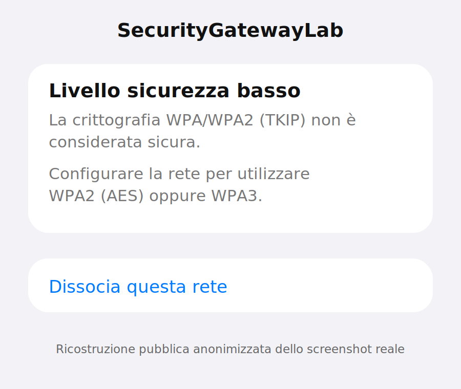
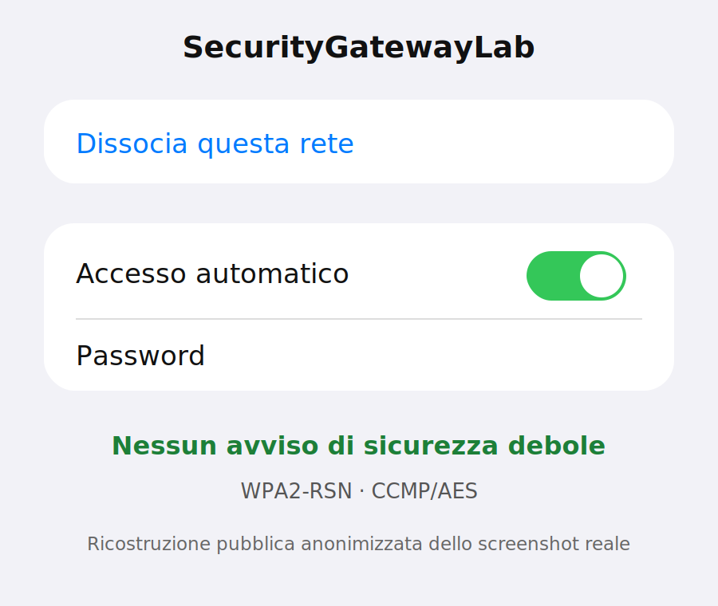

# Fase 4 — DHCP, routing IPv4 e NAT

## Stato

```text
COMPLETATA E VERIFICATA
```

Verifica eseguita il 16 luglio 2026 sul gateway Ubuntu fisico.

## Obiettivo

Verificare e documentare che un client collegato all'hotspot:

1. riceva una configurazione IPv4 tramite DHCP;
2. usi Ubuntu come gateway e DNS locale;
3. venga inoltrato dalla Realtek verso la MediaTek;
4. raggiunga Internet tramite NAT/masquerading;
5. non dipenda da un percorso alternativo come la rete cellulare;
6. mantenga cifrato il traffico applicativo HTTPS/QUIC;
7. usi una configurazione Wi-Fi WPA2-RSN con CCMP/AES, senza TKIP.

## Valori pubblicabili

```text
UPLINK_IF=wlp13s0
AP_IF=wlx<REDACTED>
HOTSPOT_PROFILE=security-gateway-ap
LAB_SUBNET=10.42.0.0/24
GATEWAY_IP=10.42.0.1
CLIENT_IP=10.42.0.x
UPLINK_NETWORK=192.168.10.0/24
UPLINK_GATEWAY=192.168.10.1
UPLINK_HOST_IP=192.168.10.x
IPV4_METHOD=shared
```

Il nome completo della Realtek, gli indirizzi MAC, la password WPA e l'indirizzo completo dell'host restano nel report privato locale.

## Architettura verificata

```text
Client autorizzato
10.42.0.x
      |
      | Wi-Fi WPA2-RSN / CCMP
      v
Realtek USB AP
10.42.0.1/24
      |
      | forwarding IPv4
      | NAT / masquerading
      v
MediaTek wlp13s0
192.168.10.x/24
      |
      v
Router 192.168.10.1
      |
      v
Internet
```

## Concetti verificati

- **DHCP** assegna indirizzo, subnet, gateway e DNS al client.
- **Routing** decide su quale interfaccia inoltrare il pacchetto.
- `net.ipv4.ip_forward=1` permette al kernel di inoltrare IPv4 tra interfacce.
- **NAT** modifica gli indirizzi dei pacchetti.
- **Masquerading** usa automaticamente l'indirizzo corrente dell'interfaccia di uscita.
- **Conntrack** conserva lo stato della traduzione e permette il NAT inverso delle risposte.
- **WPA2-RSN/CCMP** cifra il collegamento radio tra client e access point.
- **TLS/HTTPS/QUIC** protegge il contenuto applicativo fino al server remoto.
- Il DNS tradizionale sulla porta 53 può essere osservato in chiaro dal gateway.

## 1. Identificazione delle interfacce

Sono state ricavate senza inserire valori fissi nei comandi:

```bash
HOTSPOT_PROFILE="security-gateway-ap"

AP_IF="$(
    nmcli -t -f NAME,DEVICE connection show --active |
    grep "^${HOTSPOT_PROFILE}:" |
    cut -d: -f2
)"

UPLINK_IF="$(
    ip route get 1.1.1.1 |
    awk '{
        for (i = 1; i <= NF; i++) {
            if ($i == "dev") {
                print $(i + 1)
                exit
            }
        }
    }'
)"

printf 'AP_IF=%s\nUPLINK_IF=%s\n' "$AP_IF" "$UPLINK_IF"
```

Risultato pubblico:

```text
AP_IF=wlx<REDACTED>
UPLINK_IF=wlp13s0
```

## 2. Indirizzamento e route

Comandi:

```bash
ip -4 -br address show dev "$AP_IF"
ip route get 1.1.1.1
```

Risultati osservati:

```text
Realtek/AP: 10.42.0.1/24
Route Internet: via 192.168.10.1 dev wlp13s0 src 192.168.10.x
```

Interpretazione:

- `10.42.0.1/24` è l'indirizzo del gateway nella rete hotspot;
- la Realtek non crea una route predefinita;
- la route verso Internet rimane sulla MediaTek;
- il client usa un indirizzo della rete `10.42.0.0/24`, non l'indirizzo esterno di Ubuntu.

## 3. Forwarding IPv4

Comando:

```bash
sysctl net.ipv4.ip_forward
```

Risultato:

```text
net.ipv4.ip_forward = 1
```

Il valore era già attivo. Non è stato modificato manualmente durante la fase.

Questo è importante per il rollback: non bisogna impostare automaticamente il valore a `0`, perché Docker o altre connessioni condivise potrebbero dipendere dal forwarding globale.

## 4. Profilo NetworkManager condiviso

Comando:

```bash
nmcli -f \
connection.id,connection.interface-name,ipv4.method,ipv4.addresses,ipv4.gateway,ipv4.dns \
connection show security-gateway-ap
```

Risultato pubblico:

```text
connection.id:             security-gateway-ap
connection.interface-name: wlx<REDACTED>
ipv4.method:               shared
ipv4.addresses:            10.42.0.1/24
ipv4.gateway:              --
ipv4.dns:                  --
```

`ipv4.method=shared` indica che NetworkManager prepara automaticamente:

- indirizzo del gateway;
- DHCP;
- DNS forwarding;
- forwarding IPv4;
- regole di filtro;
- NAT/masquerading.

`ipv4.gateway=--` è corretto: questa connessione è il gateway per i client, non deve sostituire la route predefinita dell'host.

`ipv4.dns=--` non significa che il DNS non funzioni: NetworkManager avvia un'istanza locale di `dnsmasq` per i client.

## 5. DHCP e DNS locale

Comando:

```bash
sudo ss -tulpn | grep -E ':(53|67)\b' || true
```

Sono stati osservati:

```text
10.42.0.1:53/tcp  dnsmasq
10.42.0.1:53/udp  dnsmasq
0.0.0.0:67/udp    dnsmasq
```

Significato:

- porta `67/udp`: server DHCP;
- porta `53/udp`: richieste DNS normali;
- porta `53/tcp`: DNS su TCP quando necessario.

Nei log di NetworkManager è stata osservata una sequenza completa:

```text
DHCPDISCOVER
DHCPOFFER
DHCPREQUEST
DHCPACK
```

Questa sequenza dimostra che il client ha cercato un server DHCP, ha ricevuto un'offerta, ha richiesto l'indirizzo proposto e ha ottenuto la conferma.

## 6. Client associati

Comandi:

```bash
ip neigh show dev "$AP_IF"
sudo iw dev "$AP_IF" station dump
```

Sono stati osservati client reali con:

```text
authorized: yes
authenticated: yes
associated: yes
```

`iw station dump` verifica il livello Wi-Fi; `ip neigh` associa indirizzi IPv4 e MAC nel livello rete.

Nel repository pubblico non vengono riportati gli indirizzi MAC reali.

## 7. NAT creato da NetworkManager

Comando di sola lettura:

```bash
sudo nft list ruleset
```

L'output ha mostrato tabelle gestite tramite `iptables-nft` e una regola equivalente a:

```text
ip saddr 10.42.0.0/24
ip daddr != 10.42.0.0/24
masquerade
```

Interpretazione:

- la sorgente deve appartenere alla rete hotspot;
- la destinazione deve essere esterna alla rete hotspot;
- il kernel sostituisce l'indirizzo sorgente con quello della MediaTek;
- i contatori non nulli hanno confermato traffico reale.

Sono presenti anche regole appartenenti a Docker. Non devono essere confuse con quelle dell'hotspot.

Non è stato usato:

```bash
sudo nft flush ruleset
```

perché cancellerebbe indiscriminatamente regole gestite da altri componenti.

## 8. Cattura prima del NAT

Comando:

```bash
sudo tcpdump -n -tttt \
    -i "$AP_IF" \
    'host 10.42.0.x and port 443'
```

Esempio anonimizzato:

```text
10.42.0.x:PORTA_CLIENT > 17.253.x.x:443
17.253.x.x:443 > 10.42.0.x:PORTA_CLIENT
```

Questa cattura è stata eseguita sulla Realtek. Ubuntu vede ancora l'indirizzo interno del client.

Le righe TCP hanno mostrato:

```text
Flags [S]   apertura della connessione
Flags [S.]  risposta SYN-ACK
Flags [.]   conferma ACK
Flags [P.]  segmento con dati applicativi
```

Sono stati osservati anche datagrammi UDP sulla porta 443, compatibili con QUIC/HTTP/3.

## 9. Cattura dopo il NAT

Comando:

```bash
sudo tcpdump -n -tttt \
    -i "$UPLINK_IF" \
    'host 192.168.10.x and port 443'
```

Esempio anonimizzato:

```text
192.168.10.x:PORTA_ESTERNA > 17.253.x.x:443
17.253.x.x:443 > 192.168.10.x:PORTA_ESTERNA
```

Questa cattura è stata eseguita sulla MediaTek. Il server remoto vede l'indirizzo di Ubuntu sulla rete dell'uplink, non `10.42.0.x`.

Traduzione osservata:

```text
prima del NAT:
10.42.0.x:porta-client -> server:443

dopo il NAT:
192.168.10.x:porta-esterna -> server:443
```

La porta può restare uguale oppure cambiare. Quando cambia, il comportamento è anche chiamato PAT, Port Address Translation.

Le due catture conservate nel report sono state eseguite in momenti diversi e verso server esterni differenti: dimostrano correttamente i due lati del NAT, ma non devono essere presentate come lo stesso identico pacchetto abbinato riga per riga.

## 10. NAT inverso e conntrack

Quando il server risponde a:

```text
192.168.10.x:porta-esterna
```

il kernel consulta lo stato della connessione e riscrive la destinazione verso:

```text
10.42.0.x:porta-client
```

La risposta viene quindi inviata sulla Realtek al client corretto.

Comandi utili:

```bash
sudo conntrack -L -p tcp 2>/dev/null |
grep -E 'src=10\.42\.0\.|dst=10\.42\.0\.'

sudo conntrack -L -p udp 2>/dev/null |
grep -E 'src=10\.42\.0\.|dst=10\.42\.0\.'
```

La presenza o l'assenza di righe dipende dal fatto che la connessione sia ancora attiva quando viene eseguito il comando.

## 11. Verifica DNS

Comando:

```bash
sudo tcpdump -n -i "$AP_IF" \
    'host 10.42.0.x and port 53'
```

Esempio osservato e anonimizzato:

```text
10.42.0.x:PORTA > 10.42.0.1:53
A? time.apple.com.

10.42.0.1:53 > 10.42.0.x:PORTA
CNAME time.g.aaplimg.com.
A 17.253.x.x
```

Il record `A` richiede un indirizzo IPv4.

Il record `CNAME` indica che il nome richiesto è un alias di un altro nome canonico.

Il DNS classico sulla porta 53 non cifra il nome richiesto, quindi il gateway può leggerlo. Con DNS over HTTPS o DNS over TLS la richiesta apparirebbe invece dentro un canale cifrato.

## 12. Differenza tra NAT e cifratura

Il NAT:

```text
10.42.0.x -> 192.168.10.x
```

traduce indirizzi e, se necessario, porte. Non cifra il traffico.

La protezione è composta da livelli distinti:

```text
Client <-> Realtek AP
WPA2-RSN / CCMP
protegge il collegamento radio

Client <-> server Internet
TLS / HTTPS / QUIC
protegge il contenuto applicativo
```

Il gateway può normalmente osservare:

- IP;
- porte;
- orari;
- protocollo;
- dimensioni;
- DNS classico.

Non può normalmente leggere da una cattura passiva:

- password HTTPS;
- cookie cifrati;
- token;
- contenuto delle pagine;
- messaggi protetti da TLS.

## 13. Correzione della sicurezza Wi-Fi

La configurazione iniziale mostrava:

```text
key-mgmt: wpa-psk
proto:    --
pairwise: --
group:    --
```

L'iPhone ha segnalato che l'access point pubblicizzava una configurazione compatibile con WPA/WPA2-TKIP, considerata debole.



La configurazione è stata limitata esplicitamente a WPA2-RSN e CCMP:

```bash
sudo nmcli connection down security-gateway-ap

sudo nmcli connection modify security-gateway-ap \
    802-11-wireless-security.key-mgmt wpa-psk \
    802-11-wireless-security.proto rsn \
    802-11-wireless-security.pairwise ccmp \
    802-11-wireless-security.group ccmp

sudo nmcli connection up security-gateway-ap
```

Verifica finale:

```text
key-mgmt: wpa-psk
proto:    rsn
pairwise: ccmp
group:    ccmp
```

Dopo aver dissociato e riconnesso l'iPhone, l'avviso è scomparso.



Le immagini pubbliche sono ricostruzioni anonimizzate degli screenshot reali e non contengono password, indirizzi MAC o barra di stato.

## 14. Verifica dell'assenza di percorsi alternativi

Durante i test il traffico dati cellulare del telefono è stato disabilitato temporaneamente.

In questo modo la navigazione osservata non poteva essere attribuita a un fallback sulla rete mobile.

Il percorso verificato è stato:

```text
client -> Realtek -> Ubuntu -> MediaTek -> Internet
```

## Risultati verificati

- [x] Realtek attiva con `10.42.0.1/24`;
- [x] route Internet dell'host rimasta su `wlp13s0`;
- [x] `net.ipv4.ip_forward=1`;
- [x] profilo `ipv4.method=shared`;
- [x] `dnsmasq` attivo per DHCP e DNS;
- [x] sequenza DHCP completa osservata;
- [x] client reali autenticati, associati e autorizzati;
- [x] regole di forwarding automatiche osservate;
- [x] regola di masquerading per `10.42.0.0/24` osservata;
- [x] contatori NAT non nulli;
- [x] traffico catturato sulla Realtek prima del NAT;
- [x] traffico catturato sulla MediaTek dopo il NAT;
- [x] DNS classico osservato in chiaro;
- [x] traffico TCP 443 e UDP 443 osservato senza contenuto applicativo leggibile;
- [x] dati cellulari disabilitati durante la prova;
- [x] sicurezza aggiornata a WPA2-RSN con CCMP;
- [x] avviso iOS di sicurezza debole eliminato;
- [x] spegnimento e riattivazione dell'hotspot verificati.

## Rollback

Per fermare la condivisione dell'hotspot:

```bash
sudo nmcli connection down security-gateway-ap
```

Questo rimuove la connessione attiva, l'indirizzo `10.42.0.1/24` e le regole automatiche associate al profilo, senza eliminare il profilo salvato.

Per riattivare:

```bash
sudo nmcli connection up security-gateway-ap
```

Non usare un `flush ruleset` globale.

Non impostare automaticamente `net.ipv4.ip_forward=0`: il valore non è stato abilitato manualmente in questa fase e potrebbe essere richiesto da Docker o altre connessioni condivise.

Per tornare alle impostazioni crittografiche automatiche precedenti, soltanto se necessario:

```bash
sudo nmcli connection modify security-gateway-ap \
    802-11-wireless-security.proto "" \
    802-11-wireless-security.pairwise "" \
    802-11-wireless-security.group ""
```

La configurazione WPA2-RSN/CCMP verificata resta però quella consigliata per il laboratorio.

## Privacy

Nel repository pubblico sono stati rimossi o mascherati:

- MAC completi;
- nome completo della Realtek;
- indirizzo completo dell'host sull'uplink;
- porte effimere reali quando non necessarie;
- hostname e percorsi personali;
- password;
- output integrali non revisionati.

Gli output originali e gli screenshot completi restano nel report privato locale sotto `reports/`.

## Condizione di completamento

La fase è completata perché:

- il client riceve configurazione DHCP;
- usa Ubuntu come gateway e DNS;
- raggiunge Internet con i dati cellulari disabilitati;
- il traffico entra dalla Realtek ed esce dalla MediaTek;
- il NAT è dimostrato prima e dopo la traduzione;
- DNS, TCP 443 e UDP 443 sono stati osservati;
- la sicurezza Wi-Fi è stata corretta e verificata;
- il comportamento è ripetibile;
- il rollback del profilo è documentato.

## Prossimo passo

Passare alla fase 5 e sostituire gradualmente le regole automatiche con un firewall `nftables` stateful, limitato alla subnet del laboratorio e con rollback sicuro.
